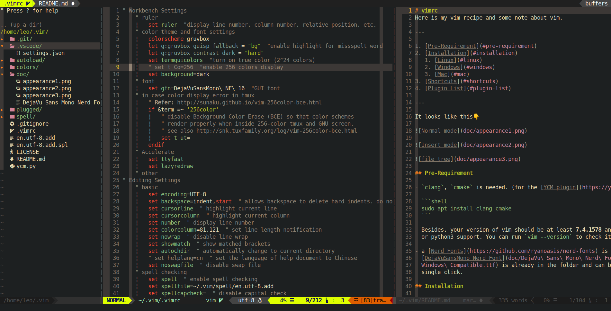
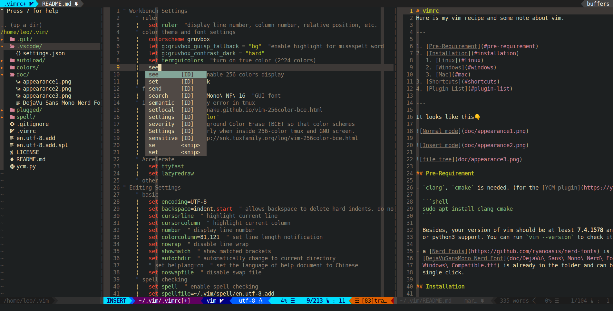
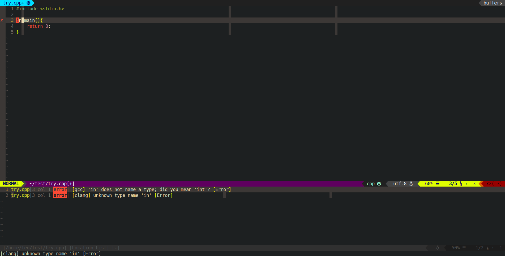

# vimrc

Here is my vim recipe and some note about vim.

---

1. [Pre-Requirement](#pre-requirement)
2. [Installation](#installation)
   1. [Linux](#linux)
   2. [Windows](#windows)
   3. [Mac](#mac)
3. [Shortcuts](#shortcuts)
4. [Plugin List](#plugin-list)

---

It looks like this👇

Normal mode with file tree



Insert mode with complete suggestions



when error is found



## Pre-Requirement

- `clang`, `cmake` is needed. (for the [YCM plugin](https://ycm-core.github.io/YouCompleteMe/#linux-64-bit))

  ```shell
  sudo apt install clang cmake
  ```

  Besides, your version of vim should be at least **7.4.1578** and have python
  or python3 support. You can run `vim --version` to check it.

- a [Nerd Fonts](https://github.com/ryanoasis/nerd-fonts) is needed. the
  [DejaVuSansMono Nerd
  Font](doc/DejaVu-Sans-Mono-Nerd-Font-Complete-Windows-Compatible.ttf) is
  already in the folder and can be installed with a single click.

💡 you may face with problem like this: [some icons becomes a chinese
character](https://github.com/ryanoasis/vim-devicons/issues/270)

## Installation

### Linux

1.download this repository to **~/.vim**

```shell
git clone https://github.com/LeoJhonSong/vimrc.git ~/.vim
```

2.then links **~/.vim/.vimrc** with **~/.vimrc**

   ⚠️ notice that you have to make sure **~/.vimrc** does not exist before this

```shell
ln -s ~/.vim/.vimrc ~/.vimrc
```

### Windows

Please try Linux 😁

### Mac

No I don't use Mac 😁

## Shortcuts

|Action|Keyboard Shortcut|
|-|-|
|Comment/Uncomment| <kbd>Ctrl , m</kbd>|
|Display/Hide File Explorer| <kbd>Ctrl , e</kbd>|
|Format Code| <kbd>Ctrl , f</kbd>|
|Open File and Split Window Horizontally| <kbd>Ctrl , h</kbd>|
|Open File and Split Window Vertically| <kbd>Ctrl , v</kbd>|
|Toggle/Close Terminal| <kbd>Ctrl t</kbd>|
|Write with Sudo| <kbd>Ctrl , w</kbd>|
|Fold and Unfold Code| <kbd>space</kbd>|
|Create Folder Specific Dictionary| <kbd>Ctrl , z</kbd>|
|switch to the window above| <kbd>Ctrl Up</kbd>|
|switch to the window below| <kbd>Ctrl Down</kbd>|
|switch to the window left side| <kbd>Ctrl Left</kbd>|
|switch to the window right side| <kbd>Ctrl Right</kbd>|
|increase the hight of window| <kbd>w=</kbd> or <kbd>F2</kbd>|
|decrease the hight of window| <kbd>w-</kbd> or <kbd>F3</kbd>|
|move left the vertical split line| <kbd>w,</kbd> or <kbd>F4</kbd>|
|move right the vertical split line| <kbd>w.</kbd> or <kbd>F5</kbd>|

## Plugin List

plugins are installed by [vim-plug](https://github.com/junegunn/vim-plug).

- [NERDTree](https://github.com/scrooloose/nerdtree)
- [NERD Commenter](https://github.com/scrooloose/nerdcommenter)
- [Auto Pairs](https://github.com/jiangmiao/auto-pairs)
- [indentLine](https://github.com/Yggdroot/indentLine)
- [vim-wakatime](https://github.com/wakatime/vim-wakatime)
- [YouCompleteMe](https://github.com/ycm-core/YouCompleteMe)
- [Rainbow Parentheses Improved](https://github.com/luochen1990/rainbow)
- [matchit](https://github.com/vim-scripts/matchit.zip)
- [UltiSnips](https://github.com/SirVer/ultisnips)
- [snipMate & UltiSnip Snippets](https://github.com/honza/vim-snippets)
- [EasyMotion](https://github.com/easymotion/vim-easymotion)
- [Vim Better Whitespace Plugin](https://github.com/ntpeters/vim-better-whitespace)
- [Asynchronous Lint Engine](https://github.com/dense-analysis/ale)
- [Markdown Preview](https://github.com/iamcco/markdown-preview.nvim)
