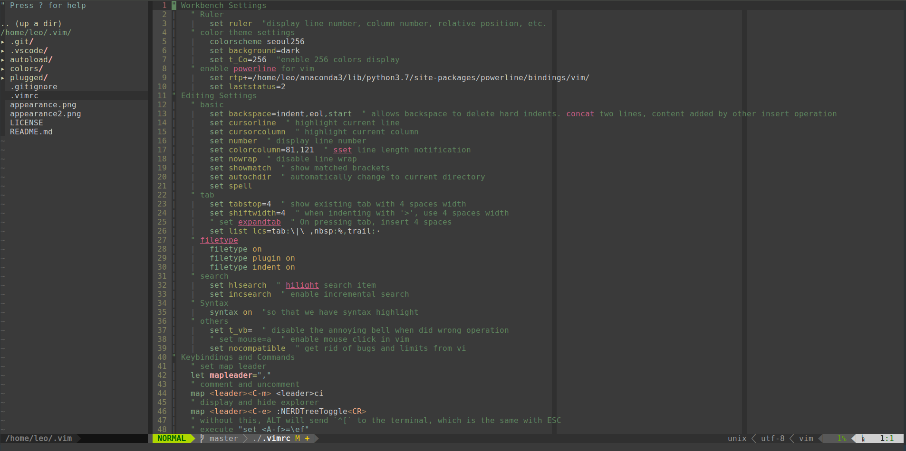

# vimrc
Here is my vim recipe and some note about vim.

---

1. [Pre-Requirement](#Pre-Requirement)
2. [Installation](#Installation)
   1. [Linux](#Linux)
   2. [Windows](#Windows)
   3. [Mac](#Mac)
3. [Shortcuts](#Shortcuts)
4. [Plugin List](#Plugin-List)

---

It looks like this👇



## Pre-Requirement

`clang`, `cmake` is needed. (for the [YCM
plugin](https://ycm-core.github.io/YouCompleteMe/#linux-64-bit))

```shell
sudo apt install clang cmake
```

Besides, your version of vim should be at least **7.4.1578** and have python or
python3 support. You can run `vim --version` to check it.

## Installation

### Linux

1.download this repository to **~/.vim/**

```shell
git clone git@github.com:LeoJhonSong/vimrc.git ~/.vim
```

2.then links **~/.vim/.vimrc** with **~/.vimrc**

   ⚠️ notice that you have to make sure **~/.vimrc** does not exist before this

```shell
ln -s ~/.vim/.vimrc ~/.vimrc
```

3.⚠️ There is three line you **must** modify in the `.vimrc`

```vim
" enable powerline for vim
set rtp+=/home/leo/anaconda3/lib/python3.7/site-packages/powerline/bindings/vim/
set laststatus=2
```

You may either delete them or comment them with `Ctrl , m`, or you may change
the path to yours.

### Windows

Please try Linux 😁

### Mac

No I don't use Mac 😁

## Shortcuts

|Action|Keyboard Shortcut|
|-|-|
|Comment/Uncomment| Ctrl , m|
|Display/Hide File Explorer| Ctrl , e|
|Format Code| Ctrl , f|
|Open File and Split Window Horizontally| Ctrl , h|
|Open File and Split Window Vertically| Ctrl , v|
|Toggle Treminal| Ctrl t|
|Write with Sudo| Ctrl , w|

## Plugin List

plugins are installed by [vim-plug](https://github.com/junegunn/vim-plug).

- [NERDTree](https://github.com/scrooloose/nerdtree)
- [NERD Commenter](https://github.com/scrooloose/nerdcommenter)
- [Auto Pairs](https://github.com/jiangmiao/auto-pairs)
- [vim-wakatime](https://github.com/wakatime/vim-wakatime)
- [YouCompleteMe](https://github.com/ycm-core/YouCompleteMe)
